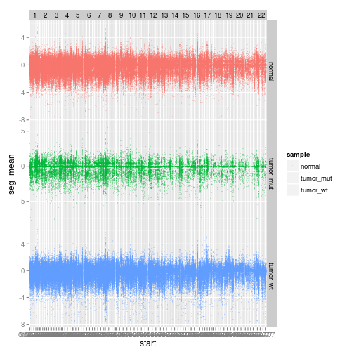
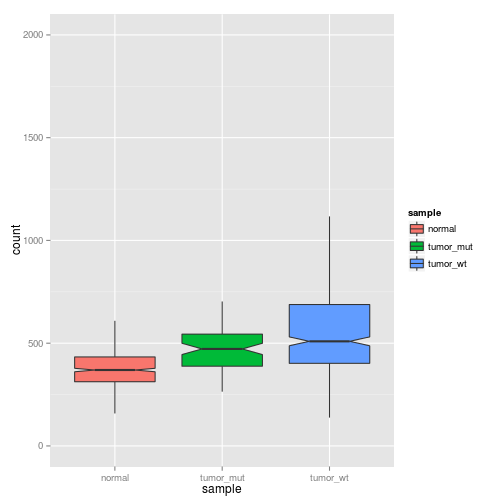
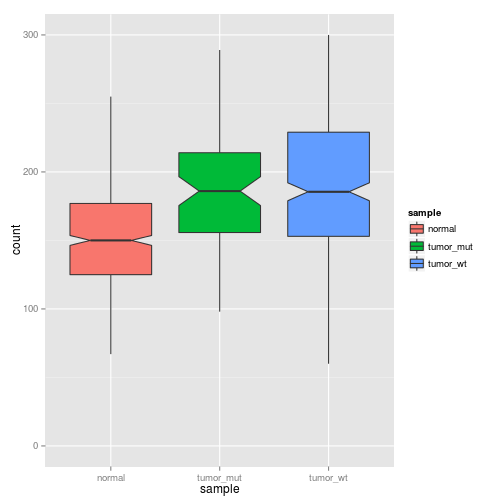
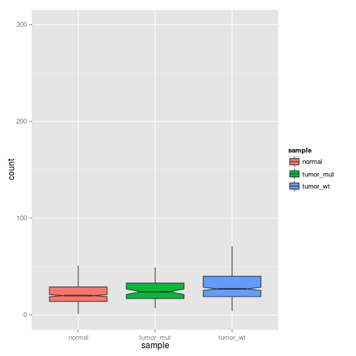
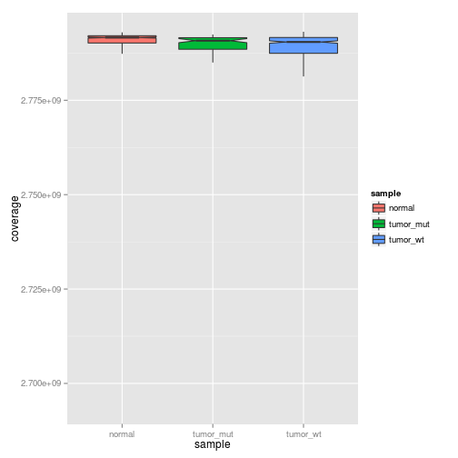
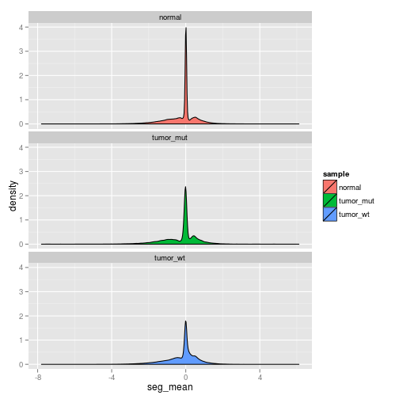
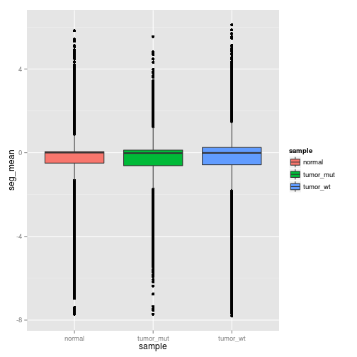
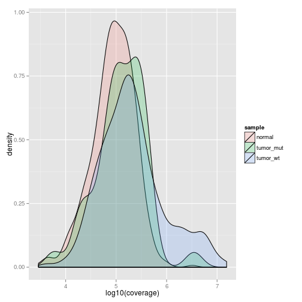
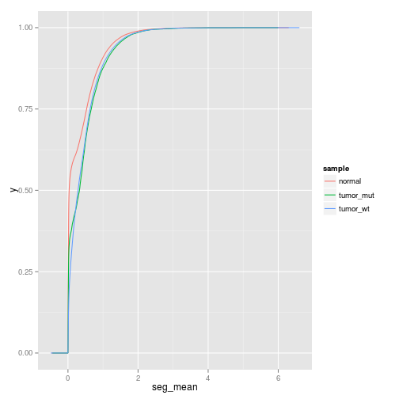

Copy Number Changes in UCEC
=============================
We are seeing evidence that ARID1A  mutant tumors, from multiple cancers, have a higher number of mutations than tumors that do not have ARID1A mutations. 

Are these changes evidence of genomic instability, and can such an instability be seen by looking at copy number changes. To address this I took CNV snp array data for UCEC ( a cancer most similiar to RC's OCCC mouse models among the TCGA data) 

The strategy is to use the .maf file of somatic mutations to ID tumor samples with and without ARID1A mutations, and try to look at copy number changes in these sets compared to normal tumor. 

The below code first sets up a data frame with information about copy number changes in each tumor sample (by barcode) and labels them as normal vs tumor_arid1a_mut vs tumor_arid1a_wt. 

```r
library(ggplot2)
library(reshape2)
library(plyr)
library(grid)
setwd("/media/data/tcga/data/ucec/CNV_SNP_Array/BI__Genome_Wide_SNP_6//Level_3")
meta <- read.table("/media/data/tcga/data/ucec/METADATA/BI__Genome_Wide_SNP_6/broad.mit.edu_UCEC.Genome_Wide_SNP_6.sdrf.txt", 
    header = T, sep = "\t")
mapping <- data.frame(barcode = meta$Comment..TCGA.Barcode., fn = paste(meta$Hybridization.Name, 
    ".hg19.seg.txt", sep = ""))
df <- data.frame(barcode = NA, chr = NA, start = 0, end = 0, seg_mean = 0, sample = NA)

dir <- "/media/data/tcga/data/ucec/Somatic_Mutations/BI__IlluminaGA_DNASeq/Level_2/"
bi <- read.table(paste(dir, "/broad.mit.edu__Illumina_Genome_Analyzer_DNA_Sequencing_level2.maf", 
    sep = ""), header = T, sep = "\t")
arid1a_muts <- bi[bi$Hugo_Symbol %in% "ARID1A", ]
arid1a_mutants <- unique(arid1a_muts$Tumor_Sample_Barcode)

getCode <- function(x) {
    z <- strsplit(as.character(x), "-")[[1]]
    id <- paste(z[2:3], collapse = "-")
    return(id)
}
arid1a_mutants <- unlist(llply(arid1a_mutants, getCode))
for (i in 1:nrow(mapping)) {
    row <- mapping[i, ]
    name <- as.character(row[1, 2])
    possibleError <- tryCatch(read.table(name), error = function(e) e)
    if (inherits(possibleError, "error")) 
        next
    fn <- read.table(name, header = T)
    tmp <- strsplit(as.character(row[1, 1]), split = "-")[[1]]
    id <- getCode(row[1, 1])
    code <- tmp[4]
    if (code >= 10) {
        sample <- "normal"
    } else {
        if (id %in% arid1a_mutants) {
            sample <- "tumor_mut"
        } else {
            sample <- "tumor_wt"
        }
    }
    df2 <- data.frame(barcode = as.character(row[1, 1]), chr = fn$Chromosome, 
        start = fn$Start, end = fn$End, seg_mean = fn$Segment_Mean, sample = sample)
    df <- rbind(df, df2)
}

df <- df[!is.na(df$chr), ]
df <- df[!df$chr == "X", ]
df <- df[!df$chr == "Y", ]
df$chr <- factor(df$chr, levels = c(1:22))
```


Now that we have made a data frame that holds the correct information, the next batch of code tries to look at how similiar or different the samples are with respect to copy number. 


```r
g <- ggplot(df, aes(x = start, y = seg_mean, colour = sample))
g <- g + facet_grid(sample ~ chr, scales = "free") + theme(panel.margin = unit(0, 
    "lines"))
g + geom_point(size = 0.75, alpha = 0.25)
```

 

This looks ok, but I don't see evidence that ARID1A mutant tumors are any different
part of the problem is that I only get a point if there is a change, so when I have tons of samples
in one group and few in the other it is difficult to compare. I think I may be discarding information by simply plotting things that change. 


Another possibility is to determine how many copy number changes are called and seeing if this number is different between the groups. 


```r
d <- ddply(df, .(barcode), summarise, count = length(seg_mean), sample = unique(sample))
ggplot(d, aes(x = sample, y = count, fill = sample)) + geom_boxplot(outlier.size = NA, 
    notch = TRUE) + scale_y_continuous(limits = c(0, 2000))
```

```
## Warning: Removed 7 rows containing non-finite values (stat_boxplot).
## Warning: Removed 21 rows containing missing values (geom_point).
## Warning: Removed 5 rows containing missing values (geom_point).
## Warning: Removed 9 rows containing missing values (geom_point).
```

 

```r
wilcox.test(subset(d, subset = d$sample == "normal")$count, subset(d, subset = d$sample == 
    "tumor_wt")$count)
```

```
## 
## 	Wilcoxon rank sum test with continuity correction
## 
## data:  subset(d, subset = d$sample == "normal")$count and subset(d, subset = d$sample == "tumor_wt")$count
## W = 53332, p-value < 2.2e-16
## alternative hypothesis: true location shift is not equal to 0
```

```r
wilcox.test(subset(d, subset = d$sample == "normal")$count, subset(d, subset = d$sample == 
    "tumor_mut")$count)
```

```
## 
## 	Wilcoxon rank sum test with continuity correction
## 
## data:  subset(d, subset = d$sample == "normal")$count and subset(d, subset = d$sample == "tumor_mut")$count
## W = 11280, p-value = 5.873e-12
## alternative hypothesis: true location shift is not equal to 0
```

```r
wilcox.test(subset(d, subset = d$sample == "tumor_mut")$count, subset(d, subset = d$sample == 
    "tumor_wt")$count)
```

```
## 
## 	Wilcoxon rank sum test with continuity correction
## 
## data:  subset(d, subset = d$sample == "tumor_mut")$count and subset(d, subset = d$sample == "tumor_wt")$count
## W = 14306, p-value = 0.005634
## alternative hypothesis: true location shift is not equal to 0
```

This strategy works in that I see differences between tumor and noral. But,there is no difference between arid1a mut or wt. 

Maybe the the magnitude of change is different, the following three blocks see if I restrict the CNV to seg_mean's greater than an arbitrary threshold (+/- 0.5, 1, 2). 

```r
d <- ddply(df, .(barcode), summarise, count = length(seg_mean[abs(seg_mean) > 
    0.5]), sample = unique(sample))
ggplot(d, aes(x = sample, y = count, fill = sample)) + geom_boxplot(outlier.size = NA, 
    notch = TRUE) + scale_y_continuous(limits = c(0, 300))
```

```
## Warning: Removed 123 rows containing non-finite values (stat_boxplot).
## Warning: Removed 8 rows containing missing values (geom_point).
```

 

```r
wilcox.test(subset(d, subset = d$sample == "normal")$count, subset(d, subset = d$sample == 
    "tumor_wt")$count)
```

```
## 
## 	Wilcoxon rank sum test with continuity correction
## 
## data:  subset(d, subset = d$sample == "normal")$count and subset(d, subset = d$sample == "tumor_wt")$count
## W = 54524, p-value < 2.2e-16
## alternative hypothesis: true location shift is not equal to 0
```

```r
wilcox.test(subset(d, subset = d$sample == "normal")$count, subset(d, subset = d$sample == 
    "tumor_mut")$count)
```

```
## 
## 	Wilcoxon rank sum test with continuity correction
## 
## data:  subset(d, subset = d$sample == "normal")$count and subset(d, subset = d$sample == "tumor_mut")$count
## W = 11622, p-value = 2.89e-11
## alternative hypothesis: true location shift is not equal to 0
```

```r
wilcox.test(subset(d, subset = d$sample == "tumor_mut")$count, subset(d, subset = d$sample == 
    "tumor_wt")$count)
```

```
## 
## 	Wilcoxon rank sum test with continuity correction
## 
## data:  subset(d, subset = d$sample == "tumor_mut")$count and subset(d, subset = d$sample == "tumor_wt")$count
## W = 14355, p-value = 0.006355
## alternative hypothesis: true location shift is not equal to 0
```

abs(seg_mean > 1)

```r
d <- ddply(df, .(barcode), summarise, count = length(seg_mean[abs(seg_mean) > 
    1]), sample = unique(sample))
ggplot(d, aes(x = sample, y = count, fill = sample)) + geom_boxplot(outlier.size = NA, 
    notch = TRUE) + scale_y_continuous(limits = c(0, 300))
```

```
## Warning: Removed 14 rows containing non-finite values (stat_boxplot).
## Warning: Removed 19 rows containing missing values (geom_point).
## Warning: Removed 2 rows containing missing values (geom_point).
## Warning: Removed 13 rows containing missing values (geom_point).
```

![plot of chunk ]](figure/_.png) 

```r
wilcox.test(subset(d, subset = d$sample == "normal")$count, subset(d, subset = d$sample == 
    "tumor_wt")$count)
```

```
## 
## 	Wilcoxon rank sum test with continuity correction
## 
## data:  subset(d, subset = d$sample == "normal")$count and subset(d, subset = d$sample == "tumor_wt")$count
## W = 64074, p-value < 2.2e-16
## alternative hypothesis: true location shift is not equal to 0
```

```r
wilcox.test(subset(d, subset = d$sample == "normal")$count, subset(d, subset = d$sample == 
    "tumor_mut")$count)
```

```
## 
## 	Wilcoxon rank sum test with continuity correction
## 
## data:  subset(d, subset = d$sample == "normal")$count and subset(d, subset = d$sample == "tumor_mut")$count
## W = 13228, p-value = 2.587e-08
## alternative hypothesis: true location shift is not equal to 0
```

```r
wilcox.test(subset(d, subset = d$sample == "tumor_mut")$count, subset(d, subset = d$sample == 
    "tumor_wt")$count)
```

```
## 
## 	Wilcoxon rank sum test with continuity correction
## 
## data:  subset(d, subset = d$sample == "tumor_mut")$count and subset(d, subset = d$sample == "tumor_wt")$count
## W = 15366, p-value = 0.05563
## alternative hypothesis: true location shift is not equal to 0
```

performs slightly worse at abs(2)

```r
d <- ddply(df, .(barcode), summarise, count = length(seg_mean[abs(seg_mean) > 
    2]), sample = unique(sample))
ggplot(d, aes(x = sample, y = count, fill = sample)) + geom_boxplot(outlier.size = NA, 
    notch = TRUE) + scale_y_continuous(limits = c(0, 300))
```

```
## Warning: Removed 2 rows containing non-finite values (stat_boxplot).
## Warning: Removed 9 rows containing missing values (geom_point).
## Warning: Removed 4 rows containing missing values (geom_point).
## Warning: Removed 22 rows containing missing values (geom_point).
```

 

```r
wilcox.test(subset(d, subset = d$sample == "normal")$count, subset(d, subset = d$sample == 
    "tumor_wt")$count)
```

```
## 
## 	Wilcoxon rank sum test with continuity correction
## 
## data:  subset(d, subset = d$sample == "normal")$count and subset(d, subset = d$sample == "tumor_wt")$count
## W = 76319, p-value < 2.2e-16
## alternative hypothesis: true location shift is not equal to 0
```

```r
wilcox.test(subset(d, subset = d$sample == "normal")$count, subset(d, subset = d$sample == 
    "tumor_mut")$count)
```

```
## 
## 	Wilcoxon rank sum test with continuity correction
## 
## data:  subset(d, subset = d$sample == "normal")$count and subset(d, subset = d$sample == "tumor_mut")$count
## W = 16934, p-value = 0.002187
## alternative hypothesis: true location shift is not equal to 0
```

```r
wilcox.test(subset(d, subset = d$sample == "tumor_mut")$count, subset(d, subset = d$sample == 
    "tumor_wt")$count)
```

```
## 
## 	Wilcoxon rank sum test with continuity correction
## 
## data:  subset(d, subset = d$sample == "tumor_mut")$count and subset(d, subset = d$sample == "tumor_wt")$count
## W = 15014, p-value = 0.02795
## alternative hypothesis: true location shift is not equal to 0
```

This suggests copy number isn't different between ARID1A wt and mutant tumors. It is possible that I am missing some ascpect of this analysis, but I currently am restricted to Level 3 TCGA data here, which only gives segment means for segments that are I assume different than expected. If I had raw data I might be able to better determine how much of the genome is amplified or lost. 

It is also possible I am not using an appropriate measure for the differences we would expect to see. 
One final option is instead of looking at total number of altered segments, see how many baspairs those alterations cover. 


```r
d <- ddply(df, .(barcode), summarise, coverage = sum(end - start), sample = unique(sample))
ggplot(d, aes(x = sample, y = coverage, fill = sample)) + geom_boxplot(outlier.size = NA, 
    notch = TRUE)
```

```
## Warning: Removed 35 rows containing missing values (geom_point).
## Warning: Removed 10 rows containing missing values (geom_point).
## Warning: Removed 39 rows containing missing values (geom_point).
```

 

That plot was interesting, it suggests that I am actually getting full coverage, although for each sample the start and top of the segment may vary.  It also suggests looking at total number of CNV segments is not super informative. Making sure the loss or gain was greater than some arbitrary value was probably a better way to handle this. 

What does the distribution of gains/losses actually look like. 

```r
ggplot(df, aes(seg_mean, fill = sample)) + geom_density() + facet_wrap(~sample, 
    ncol = 1)
```

 

```r
ggplot(df, aes(x = sample, y = seg_mean, fill = sample)) + geom_boxplot()
```

 

Neither of these show an obvious difference between the tumors or the normal, let alone between tumors. 
what happens if I look at the distribution of how many basepairs are covered in segments which gain or lose large amounts (i.e. abs(seg_mean > 2))

```r
e <- ddply(subset(df, abs(df$seg_mean) > 2), .(barcode), summarise, coverage = sum(end - 
    start), sample = unique(sample))
ggplot(e, aes(log10(coverage), fill = sample)) + geom_density(alpha = 0.2)
```

 

Seems somethign strange is happening. There is a massive difference in amount of genome covered at this level. This is a much larger difference than I would expect, I'll need to consider some other ways of quantifying CNV changes between multiple samples and multiple groups. 

I found a paper that uses many of the same approaches I have tried above. [Excessive genomic DNA copy number variation in the Li–Fraumeni cancer predisposition syndrome](http://www.pnas.org/content/105/32/11264.full) . I think the correct idea is to quantitate the number of copy variable regions in the genome. This would suggest that classifying some threshold value as copy variable is decent approach. 2 seemd like a good number for this, but at 2 I'm still seeing a median value of ~20-30 CNV in the normal samples.  The authors of the above paper see only 2-3 in the normal population, and P53 carriers having on average approx 10 CNV. Therefore I think I'm still not quite right about how I'm doing this. 

What woudl a cumulative frequency plot of these three groups look like? 

```r
ggplot(subset(df, subset = df$seg_mean < 0), aes(x = seg_mean, colour = sample)) + 
    stat_ecdf()
```

 

```r
ggplot(subset(df, subset = df$seg_mean > 0), aes(x = seg_mean, colour = sample)) + 
    stat_ecdf()
```

 

This is really no better. maybe some slight differences, but nothing major. For now I'm done looking at this data. I woudl conclude that if anything ARID1A mutant tumors are a bit more stable the WT tumors, although by most of the measures I tried, tumor was a bit more unstable than normal. 


